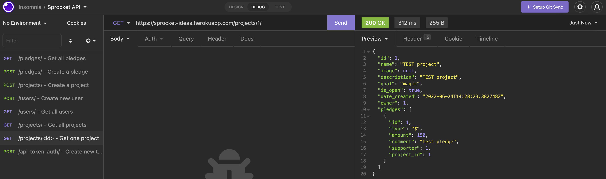
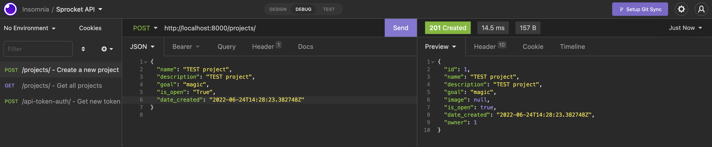

# SPROCKET IDEAS
#### Launch your ideas

***

Note: Initially, this website was going to be called 'SPROCKET' but then turns out that name was already taken on Heroku so now it's 'SPROCKET IDEAS'. *improvisation*

SPROCKET IDEAS connects thinkers and doers, champions of community, and innovators with vision and ambition with people who can help with their idea. SPROCKET is the one platform where anyone can pledge funds, time, mentorship, resources, or advice to community projects and early-stage startups. In turn, creators and founders can build their project with the help of the wider community, letting people who are interested reach out and contribute insights, advice, and time to get the launch the idea to something so much more. 
For more information, see the Trello link: https://trello.com/invite/b/nzxyiJ03/404c145882ae0a111af9b5e3aeb4ba36/sprocket

Screenshot for a successful GET request: 
Screenshot for a successful POST request: 
Screenshot for a successful POST Token request: 

To see SPROCKET IDEAS in action, visit: https://sprocket-ideas.herokuapp.com/

For a behind-the-scenes look, visit: https://github.com/SheCodesAus/she-codes-crowdfunding-api-project-jenguyenanhnhu
***

### HOW TO CREATE A PLEDGE/PROJECT AS A USER (via Insomnia)
1. Go to POST +users/+ and create a new user.
2. Go to POST +api-token-auth/+ and generate your authentication token.
3. Go to POST +projects/>+ and create a new project.
4. Go to GET +projects/+ to see all projects.
4. Go to POST +pledges/+ and create a pledge for a project.
5. Go to GET +projects/your-project-id+ and view your project.