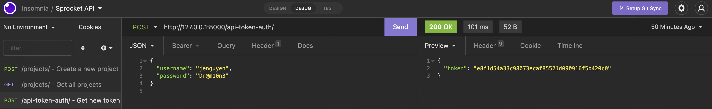

# SPROCKET IDEAS
#### Launch your ideas

***

Note: Initially, this website was going to be called 'SPROCKET' but then turns out that name was already taken on Heroku so now it's 'SPROCKET IDEAS'. *improvisation*

SPROCKET IDEAS connects thinkers and doers, champions of community, and innovators with vision and ambition with people who can help with their idea. SPROCKET is the one platform where anyone can pledge funds, time, mentorship, resources, or advice to community projects and early-stage startups. In turn, creators and founders can build their project with the help of the wider community, letting people who are interested reach out and contribute insights, advice, and time to get the launch the idea to something so much more. 
For more information, see the Trello link: https://trello.com/invite/b/nzxyiJ03/404c145882ae0a111af9b5e3aeb4ba36/sprocket
To see the API Specification and database schema for this project, first navigate to the Trello link above.

Screenshot for a successful GET request: 
Screenshot for a successful POST request: 
Screenshot for a successful POST Token request: 

To see SPROCKET IDEAS in action, visit: https://sprocket-ideas.herokuapp.com/

For a behind-the-scenes look, visit: https://github.com/SheCodesAus/she-codes-crowdfunding-api-project-jenguyenanhnhu
***

### How to navigate SPROCKET IDEAS (via Insomnia)
1. Go to POST users/ and create a new user.
    You will need to input the following: 
        "username":
        "password":

2. Go to POST api-token-auth/ and generate your authentication token.
    Input the username and password you have just created. 

3. Go to POST projects/ and create a new project.
    You need to include the following fields: 
        "name":
        "description":
        "goal":
        "is_open": True or False
        "date_created": must be in ISO format.
    There is an optional "image" field where you can attach attachments.

4. Go to GET projects/ to see all projects.

5. Go to POST pledges/ and create a pledge for a project.
    You must be logged in to create a pledge. You need to include the following fields:
	    "type": 
	    "amount": "150",
	    "comment": "test pledge",
	    "project_id": "1"

    The "type" field will only allow the following options: $, Time, Advice, Resources, and Other.

6. Go to GET projects/your-project-id and view your project.

### ISSUES
NOTE: Whenever I try to delete a user, I keep getting "Error: Transferred a partial file."